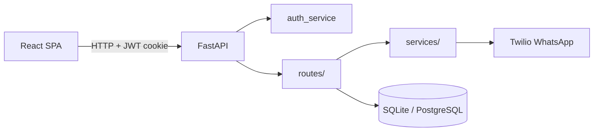

# Architecture

## Overview

```
legalcase/
├── backend/          # FastAPI API
│   ├── app/
│   │   ├── main.py           # App entry, CORS, routers
│   │   ├── database.py       # SQLAlchemy engine & sessions
│   │   ├── models/           # SQLAlchemy ORM models
│   │   ├── routes/           # API route handlers
│   │   ├── schemas/          # Pydantic request/response schemas
│   │   ├── services/         # Business logic (auth, notifications, WhatsApp)
│   │   ├── static/           # Static assets served at /static
│   │   └── templates/        # Jinja2 HTML templates (legacy pages)
│   ├── uploads/              # Uploaded documents (served at /uploads)
│   └── requirements.txt
├── frontend/         # React + TypeScript + Vite SPA
│   └── src/
│       ├── pages/            # Route-level page components
│       ├── components/       # Shared UI (Sidebar, Header, NavBar)
│       ├── api/              # Axios client
│       └── lib/              # Auth helpers, API utilities
├── scripts/          # Dev runner scripts (run.sh, run.ps1)
└── docs/             # Project documentation
```

## Tech stack

| Layer | Technology |
|-------|------------|
| API | FastAPI, Uvicorn |
| ORM | SQLAlchemy |
| Auth | JWT (python-jose), bcrypt (passlib) |
| Database | SQLite (dev), PostgreSQL (prod) |
| Frontend | React 19, TypeScript, Vite |
| HTTP client | Axios |
| Routing | React Router v6 |
| Notifications | Twilio WhatsApp (optional) |

## Request flow



## Backend layers

1. **Routes** (`backend/app/routes/`) — HTTP endpoints, dependency injection, request validation
2. **Schemas** (`backend/app/schemas/`) — Pydantic models for input/output
3. **Models** (`backend/app/models/`) — SQLAlchemy table definitions
4. **Services** (`backend/app/services/`) — Reusable business logic (auth, reminders, timeline, WhatsApp)

## Frontend structure

- **Protected routes** wrap authenticated pages in `ProtectedLayout` (sidebar + header)
- **Auth state** stored in cookies/localStorage; `/auth/me` hydrates session on load
- **API base URL** configured via `VITE_API_URL` at build time

## API route prefixes

| Router | Prefix | Purpose |
|--------|--------|---------|
| `auth_routes` | `/auth` | Login, register, token verification |
| `case_routes` | `/cases` | Case CRUD and search |
| `hearing_routes` | `/hearings` | Hearing scheduling and calendar |
| `timeline_routes` | `/timeline` | Case timeline events |
| `document_routes` | `/documents` | File upload and download |
| `notification_routes` | `/notifications` | In-app notifications and reminders |
| `dashboard_routes` | `/dashboard` | Dashboard aggregates |
| `page_routes` | `/` | Legacy HTML page routes |

## Deployment

- **Frontend**: Vercel (`vercel.json` at repo root builds `frontend/dist`)
- **Backend**: Deploy separately (Railway, Render, etc.) with PostgreSQL `DATABASE_URL`

See [deployment.md](deployment.md) for details.
