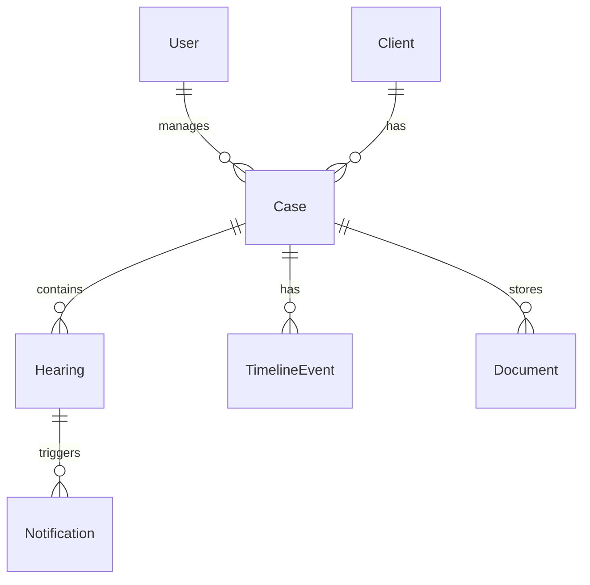

# Feature Overview

LegalCase helps law firms manage cases, hearings, documents, and client communication from a single dashboard.

## Frontend pages

| Route | Page | Description |
|-------|------|-------------|
| `/login` | Login | JWT-based authentication |
| `/dashboard` | Dashboard | Summary stats and quick overview |
| `/cases` | Cases | Create, view, edit, and search cases |
| `/hearings` | Hearings | Schedule and manage court hearings |
| `/timeline` | Timeline | Chronological case events |
| `/preparation` | Preparation List | Hearing preparation checklist |
| `/clients` | Client Details | Client contact information |
| `/documents` | Documents | Case file uploads and downloads |
| `/account` | Account Info | User profile settings |

All routes except `/login` require authentication.

## Core domains

| Domain | Doc | Summary |
|--------|-----|---------|
| Authentication | [authentication.md](authentication.md) | Register, login, JWT sessions |
| Cases | [cases.md](cases.md) | Case lifecycle and client linking |
| Hearings | [hearings.md](hearings.md) | Scheduling, calendar, upcoming views |
| Timeline | [timeline.md](timeline.md) | Event log per case |
| Documents | [documents.md](documents.md) | File storage per case |
| Notifications | [notifications.md](notifications.md) | In-app alerts and WhatsApp reminders |
| Dashboard | [dashboard.md](dashboard.md) | Aggregated metrics |

## Data model relationships

## User roles

Users have a `role` field (e.g. `lawyer`). Role-based access is enforced in route handlers and the auth service.

## Theme

The frontend supports light/dark themes persisted in `localStorage` under the `theme` key.
